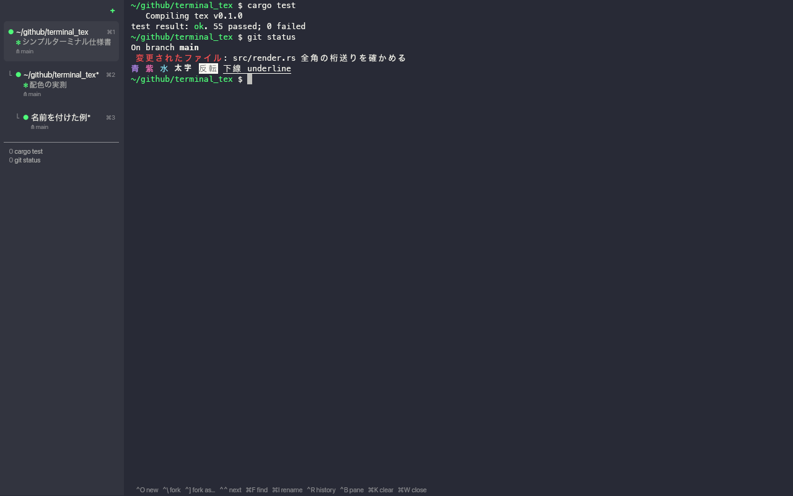

# termit

A small terminal built for working with coding agents.

It has a left pane that shows your sessions, it can fork an agent's
conversation into a new pane, it can run a session inside a Docker container,
and it keeps its own command history. That is the whole feature list.



## Why

Terminals assume one person talking to one shell. When you work with coding
agents you tend to run several at once against the same repository, branch one
off from a point in its conversation, and occasionally want one boxed in.
termit is the smallest terminal that makes those three things one keystroke
away, and nothing else.

Three rules decide what is in it.

**Only what the work needs.** A feature has to be something this way of
working does not function without, not something that would be nice to have.
The list above is short on purpose and is meant to stay short. What was left
out, and why, is under [Not goals](#not-goals).

**A terminal, and nothing more.** termit spawns processes, relays the pty,
interprets escape sequences and draws the result. It does not manage
conversations, drive an agent, or run workflows. It knows nothing about the
agent beyond the command template you give it in the config, so anything that
would require the terminal to understand what an agent is *doing* lives outside
the terminal. That line is also why the agent-specific parts — forking a
conversation, resuming one — are a string in your config rather than code in
here.

**Measured, not asserted.** Where there is a choice, the lighter one is taken,
and every claim about speed here is a number someone can reproduce.
[`docs/performance.md`](docs/performance.md) has the measurements, the tools
that produce them (`--bench`, `--throughput`, `--latency-test`, `--probe`), and
the things that were tried and rejected because they measured worse.

- **Single binary.** `cargo build --release`, no Node, no Python, no bundle.
- **Small.** A ~9 MB binary, ~85 MB resident for one pane, and 0.5–1.3 ms from
  a byte arriving on the pty to `present()` returning
  ([`docs/performance.md`](docs/performance.md) §9).

## Install

```sh
V=0.1.0
curl -fsSL "https://github.com/tkc/termit/releases/download/v$V/termit-$V-macos-arm64.tar.gz" | tar xz
./termit-$V-macos-arm64/termit
```

This build is not notarised. Nothing stops it when `curl` fetches it, because
the quarantine flag is set by whatever downloads the file, and `curl` sets
nothing. A browser does set it, and then macOS refuses to open the binary at
all — *"Apple could not verify termit is free of malware"*. If you took the
tarball from the [releases page](https://github.com/tkc/termit/releases) in a
browser, clear the flag before running it:

```sh
shasum -a 256 -c SHA256SUMS
xattr -dr com.apple.quarantine termit-0.1.0-macos-arm64
termit-0.1.0-macos-arm64/termit
```

Or build it yourself. See **[docs/BUILD.md](docs/BUILD.md)** for the details.

```sh
git clone git@github.com:tkc/termit.git
cd termit
cargo build --release
./target/release/termit
```

macOS on Apple silicon. Every number in these docs was measured on arm64 and
nothing was ever run on an Intel Mac, so no Intel binary is published — build
from source there. The renderer, the clipboard bridge and the keyboard handling
all assume macOS.

## Shell integration

Command history is not read from your shell's `HISTFILE`. termit builds it
from OSC 133 marks, so it records the command, the working directory, the exit
code and how long it took.

```sh
termit --shell-integration >> ~/.zshrc
```

Without it termit works as a terminal, but the history stays empty. Everything
else, including following `cd`, works either way: the working directory is read
from the OS as well as from OSC 7.

`^R` opens the history. It starts scoped to the current session and goes back
up to 500 commands; press `^R` again to widen to the current directory and then
to everything. Move with the arrow keys, a page at a time with PageUp and
PageDown, and Enter puts the command on the prompt without running it.

History is keyed to the session rather than to the process, so a session that
comes back after a restart still has its own history.

## Keys

Two sets. The Ctrl set is termit's own and takes exactly six keys away from the
shell and from whatever agent you run. The Cmd set follows macOS convention and
takes nothing, because neither shells nor agents use Cmd.

| Key | Action |
|---|---|
| `^O` | New session |
| `^\` | Fork the selected session |
| `^]` | Fork with a chosen profile |
| `^^` | Select the next session (wraps) |
| `^B` | Toggle the left pane |
| `^R` | Search command history |
| `⌘N` / `⌘D` / `⌘E` | New / fork / fork with a chosen profile |
| `⌘F` | Find in the screen and scrollback |
| `⌘I` (or `⌘⇧R`) | Rename the session |
| `⌘K` | Clear the screen and scrollback |
| `⌘[` / `⌘]` | Select the previous / next session |
| `⌘1`…`⌘9`, then `⌘A` `⌘G` `⌘J` `⌘L` `⌘O` `⌘P` `⌘S` `⌘T` `⌘U` `⌘X` `⌘Y` `⌘Z` | Jump to that session |
| `⌘W` | Close the session (stops it if it is still running) |
| `⌘C` / `⌘V` | Copy / paste (paste redacts credentials — see below) |
| `⌥⌘V` | Paste unchanged, without redacting |
| `⌘=` / `⌘-` | Font size |
| `Shift+PageUp` / `PageDown` | Scroll a page |
| Wheel / two fingers | Scroll the scrollback; hold `Shift` to keep it from the program |
| Drag | Select text; hold `Shift` when a program is using the mouse |
| Drag a row in the left pane | Reorder the sessions |
| Click a link | Open it — an OSC 8 hyperlink, or a URL written plainly |
| Drop a file on the window | Paste its path |

Everything else goes to the child process untouched.

**The dot on a row** is filled while the session is alive and hollow once it
has ended. Its colour is the session's state:

| Dot | Meaning |
|---|---|
| Green | Working — output is flowing, or the program's window title carries a spinner |
| Yellow | Waiting for **you** — an approval or a question is on screen |
| Dim | Idle |
| Hollow grey / red | Ended cleanly / with a non-zero status |

Yellow is the one that matters with several agents open: it separates "stopped
because it needs an answer" from "stopped because it is done". termit does not
know what any agent looks like — it matches the phrases and title characters
listed under `[agent]` in your config, and you can change them when an agent's
UI changes.

**Pasting credentials.** `⌘V` scans the clipboard and replaces anything that
looks like a cloud credential with `[redacted]` before it reaches the session.
This is aimed at one accident: you copy a block of logs, JSON or `~/.aws/credentials`
to ask an agent about it, and a live key rides along into the model's context.
The surrounding text is kept, so the agent still sees what you meant to show it:

```
aws_secret_access_key = [redacted]
"private_key": "[redacted]"
```

The bottom bar says `pasted with 2 secrets redacted — ⌥⌘V pastes it unchanged`,
so it never happens silently, and `⌥⌘V` gives you the real thing when you
actually want it — typing a key into `aws configure`, say. `⌘C` is untouched:
copying out of termit gives you exactly what is on screen.

What counts as a credential lives in `[agent]`'s neighbour `[paste]` in your
config, not in the binary. The defaults cover AWS access key IDs, AWS secret
keys and session tokens (bare or in `aws sts` JSON), GCP service-account
private keys, and Google API keys and OAuth tokens. Two limits worth knowing:

- **A bare AWS secret key cannot be detected.** It is 40 characters of base64
  with no marker; a rule that catches it also catches passwords, hashes and
  git SHAs. It is caught when it appears next to its name, which is how it
  arrives in a credentials file or an API response.
- Broad words like `password` and `token` are deliberately **not** in the
  defaults. They would fire on the code you paste for review and damage it.

**Dropping files.** Drag a file onto the window and its path is typed into
the session, followed by a space, so several files dropped together line up as
arguments. Paths that need it are quoted for the shell, so spaces and quotes
in a name do not split into separate arguments. If the program has bracketed
paste on, the path arrives as pasted text rather than as typing.

**Links.** Point at a link and it is underlined, the pointer turns into a
hand, and clicking opens it. That works both for text marked up with OSC 8 and
for a URL written plainly in the output — a URL printed by a program or echoed
back by an error message carries no markup, and needing one would make the
feature useless where it is most wanted.

Only `http`, `https`, `mailto` and `file` are opened — terminal output can
come from anywhere, and the rest is a way to launch other programs quietly.
Trailing punctuation is left out, so a URL at the end of a sentence or inside
brackets still opens correctly. The link is handed to `open` directly, never
through a shell.

To emit one from a script:

```sh
osc8_link() {
  printf '\033]8;;%s\033\\%s\033]8;;\033\\' "$1" "$2"
}
```

The terminator of OSC 8 contains a backslash. If you build a coloured string
and pass it through `printf '%b'`, the escape handling collides and the link
comes out broken. Keep the colours as real bytes (`$'\033[33m'`) and print
everything with `%s`.

**Reordering the left pane.** Drag a row and drop it where the line appears.
A session with forks under it moves together with them, and a fork moves within
its parent — the drop marker only appears where the row can actually land. The
order is part of what is restored on the next start.

**Selecting text while an agent is running.** Two things get in the way, and
both are handled.

A full-screen UI such as Claude Code turns on mouse reporting (`?1000` `?1002`
`?1003` `?1006`) when it starts, and from then on a drag belongs to the
program, not to the terminal. **Hold `Shift`** and the terminal takes the drag
instead. termit says so in the bottom bar the first time a click goes to the
program.

Such a UI also repaints constantly, and the terminal grid drops a selection the
moment the program writes over the lines it covers — so the highlight would
vanish before you reached `⌘C`. termit keeps the text of the last selection you
finished, and `⌘C` falls back to it when the live selection is gone. The kept
text belongs to the session it came from, and the next click in that terminal
replaces it.

This is unrelated to running the agent in a container, though it tends to show
up there: inside a container the agent cannot reach `pbcopy`, so anything it
copies for you has to travel by OSC 52. termit accepts OSC 52 writes (both
`BEL` and `ST` terminated, and payloads well past a screenful) — there are
tests for it.

The first nine sessions answer to `⌘1`…`⌘9`. Past that the left pane keeps
labelling rows with letters, but not in alphabetical order: `⌘B`, `⌘C`, `⌘D`
and most of the rest are already commands, so only the free letters are handed
out, and `⌘H`, `⌘M` and `⌘Q` are left to macOS. Twenty-one sessions can be
reached this way; the label a row shows is always the key that selects it.

**No binding uses Shift together with Ctrl.** On some setups that combination
never reaches the application — measured here, `ctrl` and `shift` were never
both set on the same key event. Run `termit --keytest` to see what your keys
actually arrive as.

## Mouse

| Action | Result |
|---|---|
| `+` in the left pane | New session |
| A row in the left pane | Switch to that session |
| `×` on a hovered row | Close that session |
| Drag in the terminal | Select text (`⌘C` copies) |
| Double / triple click | Select word / line |
| Wheel | Scroll |
| Drag the pane border | Resize the left pane |

When the program running in the terminal asks for mouse reporting (vim, htop,
an agent's full-screen UI), clicks and wheel go to it instead. Hold **Shift**
to select text anyway. In the alternate screen without mouse reporting the
wheel is translated to arrow keys, so `less` and `man` scroll.

## Fork

`^\` opens a new pane with the same working directory and environment, and runs
the command template from your config.

```toml
[agent]
new  = "claude --session-id {new_id}"
fork = "claude --resume {parent_agent_id} --fork-session --session-id {new_id}"
```

termit mints the UUID, so it knows the child's conversation id at spawn time.
Available variables are `{new_id}`, `{parent_agent_id}`, `{agent_id}`, `{cwd}`
and `{parent_title}`. If `fork` is unset, or if a variable has no value yet, the
fork falls back to running the parent's command in the same directory; that
session is marked with `*` in the left pane to show the conversation was not
carried over.

## Session restore

termit remembers the session list and rebuilds it the next time you start:
working directory, profile, name, tree shape and which one was selected. The
working directory is the one you are actually in, not the one the session
started in, so `cd` is carried across a restart. It is
written to `~/.local/share/termit/sessions.toml` and rewritten whenever the
list changes.

Processes cannot be restored, so each session is started again. If a session
has a conversation id and you give termit a resume template, the conversation
is picked up where it left off:

```toml
[agent]
resume = "claude --resume {agent_id}"
```

Without a resume template, or for a session that never had a conversation id,
the remembered command is simply run again. A working directory that has since
disappeared falls back to your home directory.

Turn it off with `restore_sessions = false`.

## Sandbox profiles

A profile says where a pane runs. `host` is the default and runs directly.
Anything with an `image` runs inside `<runner> run`.

```toml
[profile.sandbox]
image   = "termit-agent:latest"   # an image with your agent installed
workdir = "/work"
mount   = ["{cwd}:/work"]
env     = ["ANTHROPIC_API_KEY"]
args    = ["--dangerously-skip-permissions"]
```

The isolation comes from the mount scope and the process namespace, not from
the network. The container only sees what you mounted. Leave `network` unset
and the runner's own default applies, which reaches the internet — an agent
that cannot call its API is not useful. Set `network = "none"` under Docker for
a session that does not need to get out.

`runner` names the command, and defaults to `docker`. Anything that takes the
same arguments works, because termit only assembles the argument list:

```toml
[profile.vm]
image       = "termit-agent:latest"
runner      = "container"              # Apple's container: one lightweight VM each
mount       = ["{cwd}:/work"]
env         = ["ANTHROPIC_API_KEY", "TERM"]
runner_args = ["--memory", "2048MB"]   # goes in just before the image
```

`runner_args` is the escape hatch for flags termit knows nothing about. Two
notes for Apple's `container` specifically, both measured: it gives a container
4 CPUs and 1024 MB by default, which is a lot per session, and for about the
first second the terminal size inside is 0x0 before the real size arrives, so a
full-screen UI that reads its size once at startup can come up at 80 columns.
Starting the agent through `sh -c 'sleep 1.5; exec claude'` is enough to miss
that window. `docs/references/sandbox.md` records the measurements.

Profiles are orthogonal to forking: `^]` forks into a profile you pick, so you
can move a conversation into a container right before something risky.

## Configuration

`~/.config/termit/config.toml`, read once at startup. No file means defaults.

```toml
[window]
font             = "Menlo"  # falls back to the generic monospace if not found
font_size        = 13.0
scrollback       = 10000
sidebar_width    = 200      # points; drag the border to change it live
vsync            = true     # false removes the wait for the display, may tear
restore_sessions = true     # rebuild the session list on the next start

[shell]
program = "/bin/zsh"
args    = ["-l"]

[paste]
# Redact credentials on ⌘V. ⌥⌘V always pastes unchanged.
mask   = true
# Each rule is a regex. The part named `secret` is what gets replaced, so the
# name and the quotes around it survive; a rule with no `secret` group replaces
# the whole match. A broken regex is reported at startup, not at paste time.
redact = [
  '\b(?P<secret>(AKIA|ASIA|ABIA|ACCA)[0-9A-Z]{16})\b',
  '(?i)"(aws_secret_access_key|secretaccesskey|sessiontoken|private_key|client_secret)"\s*:\s*"(?P<secret>[^"]+)"',
  '(?i)\b(aws_secret_access_key|aws_session_token|account_key)\b\s*[=:]\s*(?P<secret>[A-Za-z0-9/+=_.-]{16,})',
  '\b(?P<secret>AIza[0-9A-Za-z_-]{20,})\b',
  '\b(?P<secret>ya29\.[0-9A-Za-z_-]+)',
]

[agent]
# The dot turns green while the title starts with one of these, even when the
# program has stopped printing. Agents spin one of them while they think.
working_title = "⠋⠙⠹⠸⠼⠴⠦⠧⠇⠏◐◑◒◓"
# The dot turns yellow when any of these appears in the last lines of the
# screen. Compared case-insensitively. Empty list turns the check off.
blocked_when  = [
  "do you want to proceed?",
  "esc to cancel",
  "waiting for permission",
  "do you want to allow",
]
blocked_lines = 12   # how many lines from the bottom to read
```

The `[agent]` table is data, not code: termit reads a title and some phrases and
compares them. Nothing in the binary knows what Claude Code or Codex look like,
so when an agent changes its wording you edit the config rather than wait for a
release.

`scrollback` is per session, and a row costs its full width whether or not
anything is on it — `lines × columns × 24 bytes`. At the default 10000 lines
and 200 columns that is 48 MB for one session that has filled it, so a dozen
busy sessions can reach several hundred megabytes. Nothing leaks — memory
stops growing once the limit is reached — but if you keep many sessions open,
lower this. `docs/performance.md` has the measurements.

A bad value is reported at startup and termit exits; it never silently
substitutes a default.

## Terminal capabilities

Chosen by recording what an agent's full-screen UI actually asks for.

| | |
|---|---|
| Mouse reporting (`?1000` `?1002` `?1003` `?1006`) | yes |
| Focus reporting (`?1004`) | yes |
| Bracketed paste (`?2004`) | yes |
| Alternate screen (`?1049`) | yes |
| Alternate scroll (`?1007`) | yes |
| Window title (`OSC 0` / `OSC 2`) | yes |
| Clipboard (`OSC 52`) | yes |
| Device attributes (`CSI c`) | yes |
| Synchronized output (`?2026`) | yes |
| Bell | no |
| Desktop notifications (`OSC 777`) | no |
| Hyperlinks (`OSC 8`) | yes |
| Kitty keyboard protocol | no |

## Not goals

Tabs. Arbitrary splits and tiling. Ligatures. Image protocols. A plugin
system. A built-in editor. A theme store. A settings GUI. A built-in SSH
client.

Each of these is either a second way to do something the left pane already
does, or a job that belongs to a program you run *inside* a terminal rather
than to the terminal itself. The left pane replaces tabs and splits: several
agents are several sessions in one list.

## Design notes

The detailed design record is in Japanese.

- [`docs/superpowers/specs/2026-09-08-agent-terminal-design.md`](docs/superpowers/specs/2026-09-08-agent-terminal-design.md) — the specification
- [`docs/performance.md`](docs/performance.md) — where the time actually goes, measured
- [`docs/references/performance-techniques.md`](docs/references/performance-techniques.md) — techniques taken from other terminals, each marked adopted, rejected with the measurement, or still open
- [`docs/references/paste.md`](docs/references/paste.md) — what iTerm2 does at the paste boundary, and which half of it termit took
- [`docs/references/agent-state.md`](docs/references/agent-state.md) — how other tools tell a working agent from one that is waiting for you, and which parts of that termit adopted
- [`docs/references/sandbox.md`](docs/references/sandbox.md) — how agents are sandboxed elsewhere, what Apple's `container` measured at, and what termit deliberately leaves outside
- [`docs/references/scrollback.md`](docs/references/scrollback.md) — how five other implementations handle scrollback, and which parts were copied
- [`docs/warp-metrics.md`](docs/warp-metrics.md) — the sizes and paddings the left pane is based on

## License

MIT. See [LICENSE](LICENSE).
